# 点餐系统需求规格说明

# 6.2 用例文本与活动图
整个系统按照业务划分为下面几个用例，用例文本引用了子用例图，并添有必要的活动图辅助说明。
**基本用例：**
## 6.2.1 注册登录

一个餐厅作为一个店铺用户，可以注册、登录系统。

| 版本 | 日期 | 描述 | 作者|
| -- | -- | -- | -- |
| 1.5.0 | 2018.12.12 | 详述版用例 | zq |

#### 用例描述
**用例图：**  
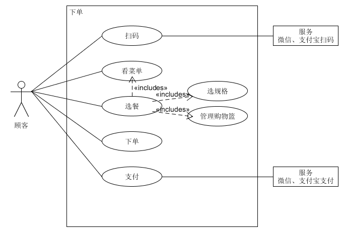

**范围：** 客户端

**级别：** 用户目标

**主要参与者：** 客户

**涉众及其关注点：**
-  顾客：快速便捷点餐下单，清楚知道每个菜的信息
- 餐厅：减少服务员点餐收银的人工成本，让顾客点餐信息准确地直达后厨

**前置条件：** 顾客到店在一张桌子边坐下

**后置条件：** 订单信息传到餐厅管理端

**主成功场景：**
1. 直接扫描桌面二维码，查看菜单
2. 选中某样菜品，弹出浮窗选择规格，确认后添加到购物篮，购物篮累计价格。
重复步骤2，直到顾客全部选好
3. 下单，确认订单信息和价格
4. 支付，系统处理支付，下单完成
5. 餐厅收到新的订单

**扩展：**

*a. 任意时刻发送网络请求失败  
保存好用户操作，包括已点菜品，页面状态。
  1. 询问失败是否重试
  2. 修复网络问题，网络恢复
  3. 系统重建当时的操作场景

1a. 亦可先进入小程序  
  1.从微信顶部点击小程序图标进入，显示历史订单界面
  2.跳到点餐界面，无菜单信息
  3.提示用户进行扫码

2a. 选中售罄菜品  
不能添加进购物篮

2b. 取消选中某样菜品或减少份数
  1. 点开购物篮，弹出已选菜品列表
  2. 点击按钮直接减少份数或者从购物篮中移除
  3. 订单信息变化，购物篮价格相应减少

2c. 更改某样菜品规格
  1. 点开购物篮，弹出已选菜品列表
  2. 选中某项菜品，弹出浮窗显示用户之前选择的规格
  3. 更改规格，点击修改按钮确定
  4. 订单信息变化，购物篮价格相应改变

3a. 要修改订单
  1. 直接返回点餐页面

**特殊需求：**
- 列表浏览时顺滑的用户体验

**技术与数据变元表：**

**发生频率：** 十分频繁

**未决问题：**
- 系统如何处理支付

#### BCE 
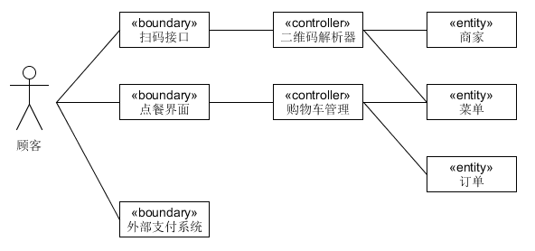

#### 顺序图
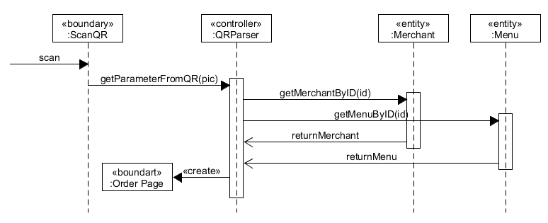
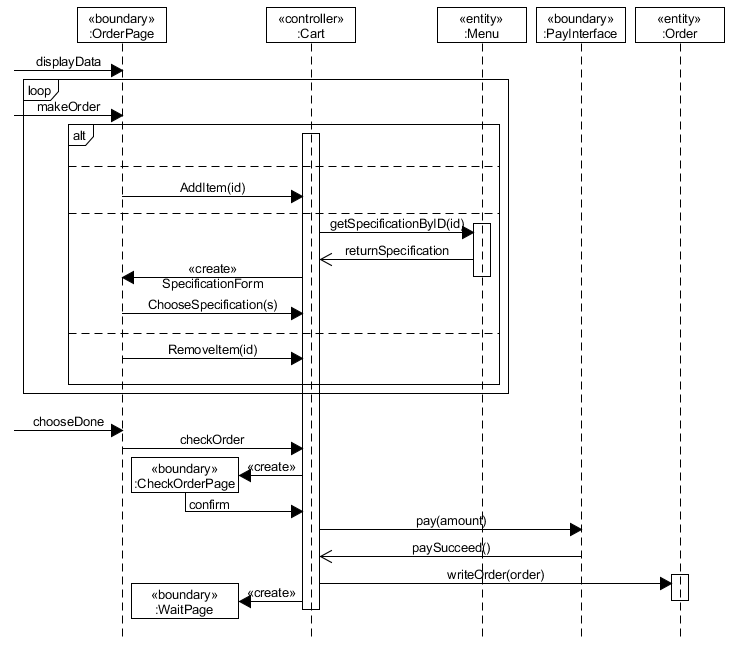

#### 类图
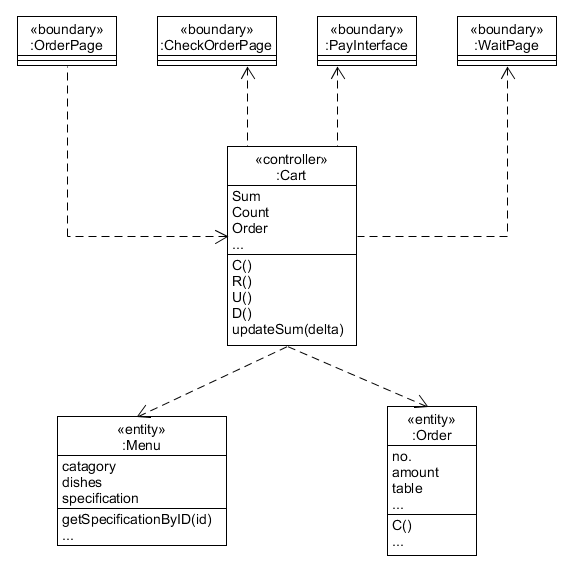

## 6.2.2 管理菜品信息

餐厅管理员可以对菜品信息进行管理，包括分类管理、价格管理、普通信息管理、对菜品的查找、对分类和菜品排序。

#### 菜品的管理分为以下几个需求：

1. 管理分类 

*特别说明*：如果考虑“店长推荐”“新品”这种特殊分类（是有对应需求场景的），那一个菜品应该可以属于多个分类。但在目前的方案中我们决定先限制使用单分类而不考虑这样的需求。管理菜品所属分类时从已有分类中选择一个即可，若还没有分类则需要新建分类。  
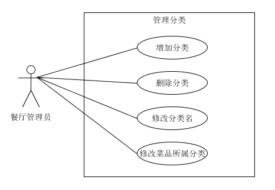
        
2.管理价格  
菜品依据规格定价，每个菜品有一个基础价格，再加上规格的组合确定最终价格——每个规格选项对应一个价格的增量或者减量。卡片上会显示“最低￥ 起”（若有价格区间），菜品详情会显示一组默认规格。
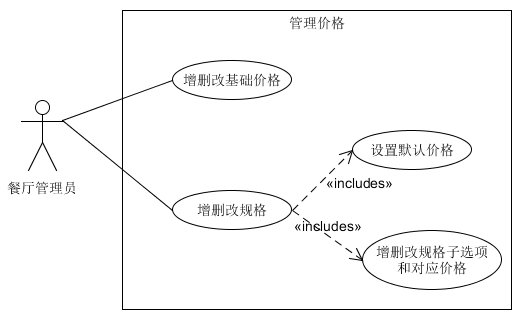

3.管理菜品的基本信息  
对图、名、描述、状态、标签的增删改。

4.查找菜品  
- 按菜品搜索
- 按状态（售卖中/已下架）筛选

5.排序  
菜品和分类都需要排序以调整显示上的先后。  
考虑到PC端显示菜品卡片的列数会比手机移动端多，影响对顺序的理解，因此设计快速编辑模式，以列表的形式展现菜品（而非标准的卡片）。在快速编辑的列表中可以对菜品常用的几个信息进行编辑，以拖动的交互形式进行排序。
        
** 非功能性需求：编辑提示  
增删改时的必填项，输入规范等。

#### 典型用例：
对菜品具体某个信息或属性的修改删除，以及排序查找等用例都只需要简单的一两步动作，因此不做详细的文本描述。这里仅以新建菜品作为典型用例。

| 版本 | 日期      | 描述     | 作者         |
| ---- | --------- | -------- | ------------ |
| 1.5.0  | 2018.12.23 | 新建菜品 | zq |

**用例名称：** 新建菜品

**范围：** Web应用

**级别：** 用户目标

**主要参与者：** 餐厅管理员

**涉众及其关注点：**  
管理员希望能够编辑菜品各种必要信息，方便顾客查看。

**前置条件：** 管理员正常登陆系统

**后置条件：** 生成一个新的菜品信息，PC端和小程序端均可查看。

**主成功场景（或基本流程）：**  
1. 填写菜品名称
2. 选择菜品分类
3. 上传菜品图片
4. 填写基础价格
5. 增设规格及对应价格（可选、循环）
6. 编辑附加信息（可选）
7. 增加系统默认（辣度）或自定义标签（可选）
8. 点击确认按钮，前后端同步新增菜品信息

**扩展流程：**

*a. 系统在任意时刻失败：  
1. 管理员重启系统，登录系统
2. 系统重建上一次的状态

*b. 任意信息填写不符合规范：
1. 提示不合规范的原因
2. 管理员重新输入

1a. 管理员输入数据库中已存在的菜品名称：  
1. 系统提示已存在该菜品
2. 重新输入菜品的名称，或退出当前的操作

2a. 暂时没有分类：
1. 提示暂无分类
2. 管理员新建一个分类
3. 再次选择

3a. 管理员上传的菜品图片超过3M：  
1. 系统提示管理员图片不能超过3M
2. 管理员重新选择合适的图片并上传

5a. 增加规格扩展流程：
1. 填写规格名，如配菜
2. 填写规格选项A的名称，并设置该选项对应的价格增降或0
3. 填写选项B、C...
4. 设置该规格对应的默认规格

8a. 有必填信息为空：  
1. 系统提示
2. 管理员补上必填信息
3. 重新点击确认

**特殊需求：**  
- 使用分辨率较高的显示器
- 服务器的健壮性，保证菜品图片能够正常显示

**技术和数据元表：**  
- 餐厅管理员通过键盘上的数字键输入菜品的价格
- 餐厅管理员需选择jpg，png，jpeg等图片格式的文件上传菜品的图片

**发生频率：** 一般或较低

**未决问题：** 暂无

## 6.2.3 生成每桌二维码

餐厅管理员可以用系统为餐厅的每一张餐桌生成独特的二维码（供用户扫码点餐）。

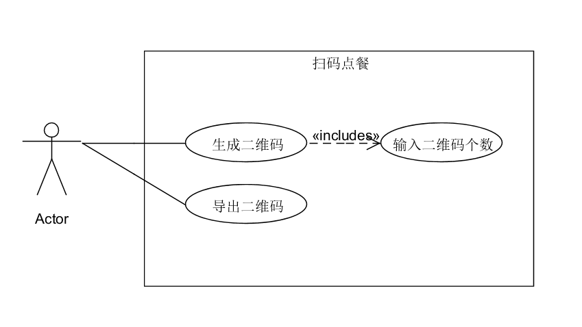

|     用例名称     | 生成每桌二维码                                  |
| :----------: | :--------------------------------------- |
|      范围      | web应用                                    |
|      级别      | 用户目标                                     |
|    主要参与者     | 餐厅管理员                                    |
|   涉众及其关注点    | 餐厅管理员：希望能准确、简便地为每张桌子生成对应的二维码。            |
|     前置条件     | 餐厅里有多张桌子，且每张桌子有自己的编号。                    |
| 成功保证（或后置条件）  | 为每张桌子生成特定的二维码。                           |
| 主成功场景（或基本流程） | 1. 餐厅管理员输入要生成的二维码的个数。 2. 系统生成并显示相应个数的二维码，每个二维码有对应的编号（从1开始）。 3. 餐厅管理员导出所有的二维码，每个二维码旁有相应的编号标志。 |
|  扩展（或替代流程）   | 1a. 餐厅管理员输入不合法     1. 不生成二维码，屏幕上会出现提示，让管理员重新输入。 |
|     特殊需求     | 1. 二维码旁边对应的编号要显而易见。                      |
|   技术和数据元表    | 1a. 关于二维码的个数，餐厅管理员可以通过键盘输入。 2a. 每个生成二维码旁边有对应的编号。 |
|     发生频率     | 偶尔会发生。                                   |
|     未决问题     | 未实现定期更新二维码功能，可能存在顾客远程插队点餐的情况。            |

## 6.2.4 查看订单（商家端）

餐厅管理员通过查询限制条件（订单时间、订单号、订单状态），查询得到符合条件的历史订单，并允许查看每一条历史订单的详细信息。

|     用例名称     | 查看订单                                     |
| :----------: | :--------------------------------------- |
|      范围      | web应用                                    |
|      级别      | 用户目标                                     |
|    主要参与者     | 餐厅管理员                                    |
|   涉众及其关注点    | 餐厅管理员：希望能准确地看到某一时间段内、或者某个订单号、或者某种状态的订单的详细账单信息。 |
|     前置条件     | 每次成功订单的信息（订单号、时间、金额、最终状态、餐桌号）都能被准确录入系统。  |
| 成功保证（或后置条件）  | 准确、清晰地显示对应时间的账单信息。                       |
| 主成功场景（或基本流程） | 1. 餐厅管理员可以通过查询某一时间段（输入起始日期和结束日期），或者通过输入订单号、订单状态来查询符合条件的账单，点击确定查询。 2. 系统显示满足输入条件的账单信息：每个订单的信息（订单号、时间、金额、最终状态、餐桌号）。 3. 餐厅管理员可以点击查看某一订单的详细信息（包括订单号、时间、金额、最终状态、餐桌号、菜色信息、状态流水）。 4. 重复1-3步骤。 |
|  扩展（或替代流程）   | 1a. 餐厅管理员没有输入任何限制条件：     1. 显示所有历史账单信息。 2a. 符合查询条件的账单信息过多。     1. 分页显示。 2b. 查不到符合查询条件的账单信息：     1.显示为空。 |
|     特殊需求     | 账单信息的显示要能适应各种屏幕大小，清晰地显示。                 |
|   技术和数据元表    | 1a. 餐厅管理员通过选择时间框选择起始日期和结束日期。 1b. 餐厅管理员通过键盘输入订单号或者订单状态。 2a. 从数据库中得到相应的信息，并以列表的形式显示在餐厅管理员的用户界面上。 |
|     发生频率     | 可能会经常发生。                                 |
|     未决问题     | 1. 税率问题。 2. 故障恢复修改问题。                 |

## 6.2.5 处理订单

餐厅收到顾客的点餐信息（桌号、餐饮类型与数量、备注），以及用户的付款，可以选择拒绝或接受，若接受则根据信息打印票据。

## 6.2.6 点餐

顾客进入餐厅就坐，用手机扫描贴在桌上二维码，手机显示出该餐厅的点餐菜单。顾客可以选择餐饮种类以及数量、添加备注，下单，点击结算、支付，完成点餐。

| 版本 | 日期 | 描述 | 作者|
| -- | -- | -- | -- |
| 1.5.0 | 2018.12.12 | 详述版用例 | zq |

#### 用例描述
**用例图：**  

**范围：** 客户端

**级别：** 用户目标

**主要参与者：** 客户

**涉众及其关注点：**
-  顾客：快速便捷点餐下单，清楚知道每个菜的信息
- 餐厅：减少服务员点餐收银的人工成本，让顾客点餐信息准确地直达后厨

**前置条件：** 顾客到店在一张桌子边坐下

**后置条件：** 订单信息传到餐厅管理端

**主成功场景：**
1. 直接扫描桌面二维码，查看菜单
2. 选中某样菜品，弹出浮窗选择规格，确认后添加到购物篮，购物篮累计价格。
重复步骤2，直到顾客全部选好
3. 下单，确认订单信息和价格
4. 支付，系统处理支付，下单完成
5. 餐厅收到新的订单

**扩展：**

*a. 任意时刻发送网络请求失败  
保存好用户操作，包括已点菜品，页面状态。
  1. 询问失败是否重试
  2. 修复网络问题，网络恢复
  3. 系统重建当时的操作场景

1a. 亦可先进入小程序  
  1.从微信顶部点击小程序图标进入，显示历史订单界面
  2.跳到点餐界面，无菜单信息
  3.提示用户进行扫码

2a. 选中售罄菜品  
不能添加进购物篮

2b. 取消选中某样菜品或减少份数
  1. 点开购物篮，弹出已选菜品列表
  2. 点击按钮直接减少份数或者从购物篮中移除
  3. 订单信息变化，购物篮价格相应减少

2c. 更改某样菜品规格
  1. 点开购物篮，弹出已选菜品列表
  2. 选中某项菜品，弹出浮窗显示用户之前选择的规格
  3. 更改规格，点击修改按钮确定
  4. 订单信息变化，购物篮价格相应改变

3a. 要修改订单
  1. 直接返回点餐页面

**特殊需求：**
- 列表浏览时顺滑的用户体验

**技术与数据变元表：**

**发生频率：** 十分频繁

**未决问题：**
- 系统如何处理支付

#### BCE 

#### 顺序图

#### 类图

## 6.2.7 查看历史订单（移动端）

顾客可以在手机端查看自己之前下过的订单即历史订单。

## 6.2.8 取消订单（移动端）

顾客在下单成功之后，若商家还未接单或者未拒单，用户可以取消订单。

**扩展用例：**

## 6.3.1 呼叫服务员

顾客在小程序端的点餐界面有个呼叫服务员按钮，一按餐厅端（网页端）的服务员便收到信息（桌号、时间）。

## 6.3.2 催单

顾客点餐后过了好久都没上菜，可以在小程序的点餐界面点击催单按钮，餐厅端（网页端）收到催单信息（桌号、时间）。

**选做用例：**（第一个可用版本之前不考虑）

## 6.4.1 多人点单

当有多个顾客聚餐时，允许多人同时用手机扫描同一张桌子二维码，每个人的手机都显示出点餐菜单，顾客可以同时点餐，并将点餐数据统一到一份点餐订单上，发送到餐厅端。

## 6.4.2 餐厅营业

餐厅管理员可以查询近期账单（各菜色的销量、收入）。

## 6.4.3 多人支付

当有多个顾客聚餐时，支持AA支付法，每个顾客支付各自的部分。

## 6.5 其它
下面是主成功场景下商家开业前，商家开业后和顾客使用的活动图，在更多活动图见img_activity文件夹。

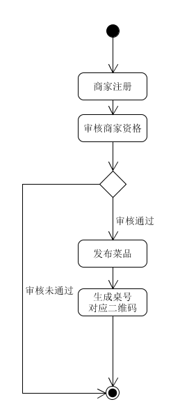
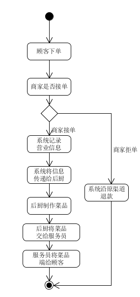
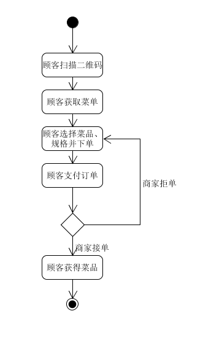
