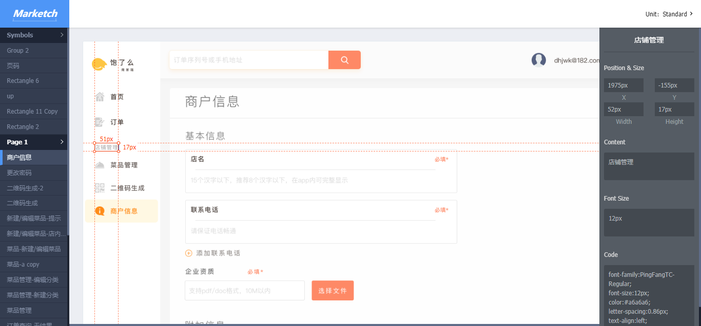

# 点餐系统 Design

## 7.1 UI Design

### 7.1.1 登录注册部分
1. 注册流程

2. 登陆

3. 注册

4. 注册成功

### 7.1.2 除登录注册部分
使用[页面流和数据约定](assets/UI/page_flow_PC.md)进行前期约束。最后统一使用插件标注设计元素，导出[HTML设计文件](assets/UI/UI.html)。点击任意设计图中的元素会在周围和右侧显示出相关参数：
