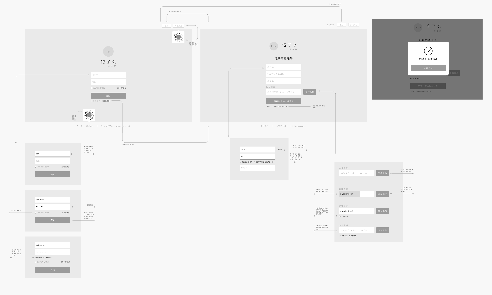
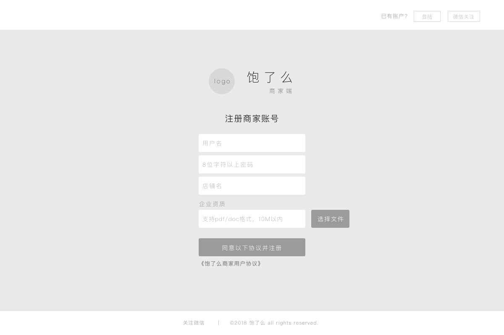
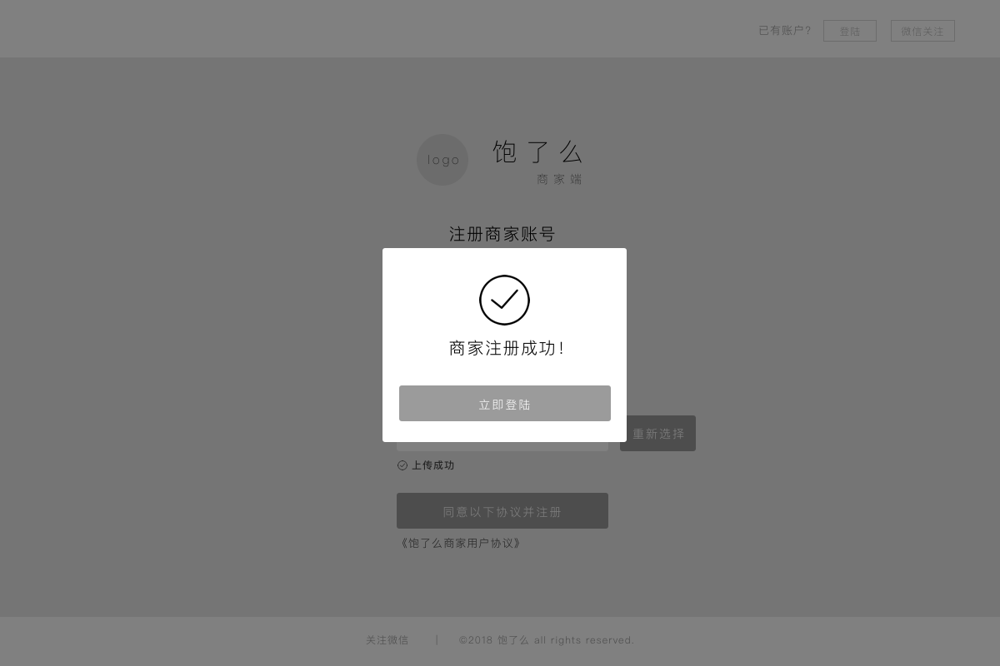
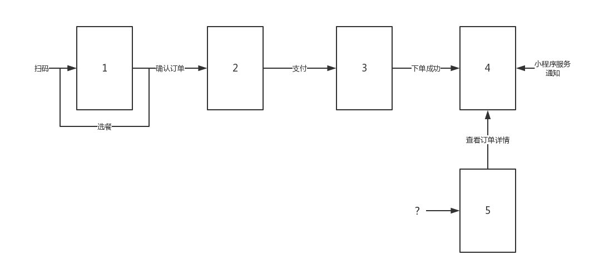

# 点餐系统 Design
{:.no_toc}

* 目录
{:toc}

## 7.1 UI Design

### 7.1.1 登录注册部分
1. 注册流程

2. 登陆

3. 注册

4. 注册成功

### 7.1.2 除登录注册部分
使用[页面流和数据约定](assets/UI/page_flow_PC.md)进行前期约束。

最后统一使用插件标注设计元素，导出[HTML设计文件](assets/UI/UI.html)。

点击任意设计图中的元素会在周围和右侧显示出相关参数：

### 7.1.3 客户端
#### 客户端页面流与数据约定

##### 1.选餐界面
包含：分类列表、菜品列表、店铺信息、购物篮、计价、

  - 店铺信息：店的Logo、店名、电话
  - 菜品列表项：图、名、价、标签、简介（可选）
  - 菜品详情：大图、完整简介
  - 菜品弹窗：图、名、价、规格
  - 购物篮弹窗（已选菜品列表）：名、价、规格（可选）、份数

***注：*** 
  - 标签例如大拇指和小辣椒；
  - 可选的意思是可以根据设计需要取舍——显不显示在列表中没关系；
  - 规格无论辣度、甜度、温度、份量、配菜统一采取规格名+选项ABC的模式，一个菜品可以有多个规格项叠加；

##### 2.确认订单界面

包含：桌号、备注填写区、已选菜品列表、支付方式

  - 已选菜品列表：参见选餐界面，另加总计
  - 支付方式：暂时只支持微信

##### 3.支付及支付成功界面

不必画

##### 4.下单完成界面（订单详情页）

包含：订单状态、已选菜单列表、订单号、下单时间

  - 订单状态：下单成功（时间点）、商家接单（时间点）、用餐结束（时间点）
  - 下单时间：日期+时间点

##### 5.历史订单界面

包含：订单列表
  - 订单项信息：日期、店铺名、总价、状态