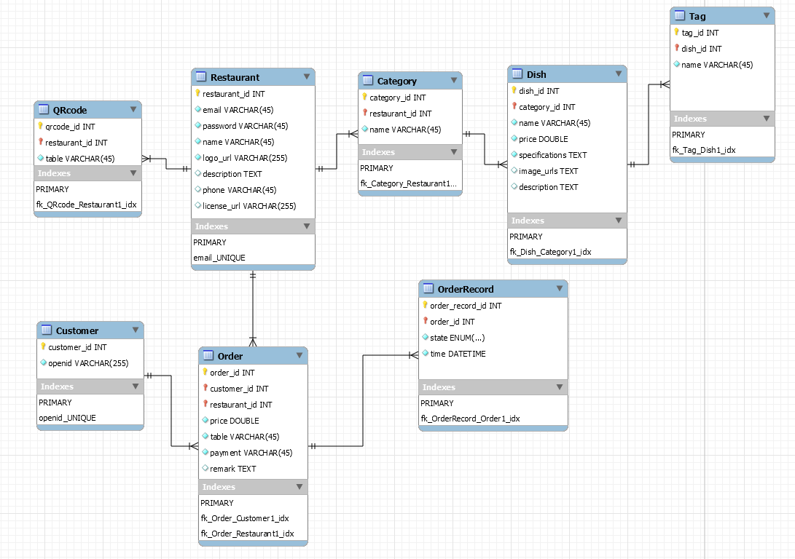

# 点餐系统 Design

## 7.2 Database design

包含了系统基础框架所需的完整数据库设计。

系统主要面向两类用户，食客和商家，分别由移动端和商家端提供服务。  

我们目前没有权限系统的设计，两类角色对系统的对象和数据资源的控制，并不需要用不同的权限加以区分，被限制只能做安全操作。

目前的迭代也暂时不考虑更高层次的，需要危险动作的内务管理需求。

### 7.2.1 第三方数据评审结果
#### 问题

1. 对于顾客来说，点餐是其主要业务，不应作为一个大的用例，点餐系统是服务于这个业务的
2. 顾客缺少扫码用例
3. 对于商家与顾客的业务分离会不会好点，画成两张用例图，一张商家管理系统，一种顾客点餐系统
4. 对于后台，有无管理商家与顾客系统的需求

#### 决议

1. 同意
2. 同意
3. 同意
4. 同意