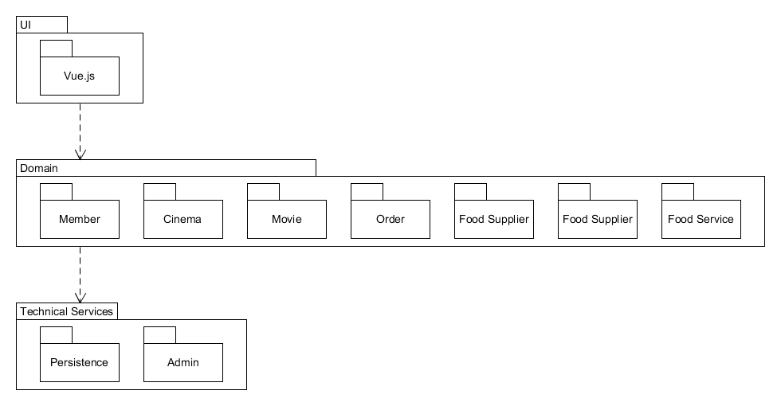
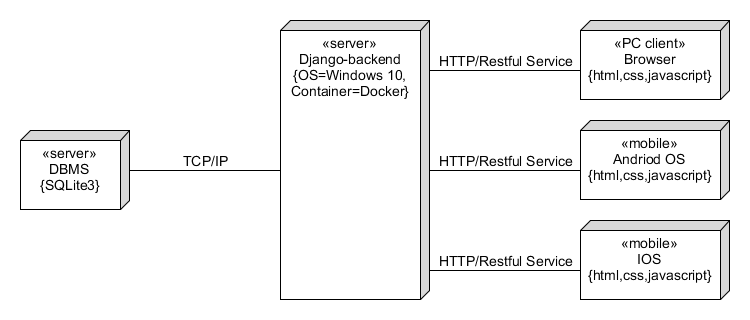

# 点餐系统 Design

## 7.4 Software Architecture Document

### 架构问题
- 可靠性——用户重复提交订单的问题

#### 鉴权

由于一个服务端同时服务顾客端和餐厅端，因此需要对API进行鉴权。即将顾客端API不允许餐厅端调用，餐厅端API也不允许顾客端调用。此外，还有部分API是允许未登录用户调用，而部分API必须登录用户才能调用。考虑到这样的鉴权需要，需要一个简单有效的鉴权方案。

#### 多核计算资源

在技术选型时，我们选择使用Node.js编写服务端。由于Node.js是单核单线程语言，默认情况下无法有效利用服务器的多核计算资源。因此，需要设计一个有效的并行架构，使得能够同时运行多个Node.js服务器实例，通过均衡负载，充分利用多核计算资源。

#### 可扩展的结构

服务端需要一个可扩展的结构对服务进行分层，从而兼顾开发效率和运行效率。

#### 自动测试与部署

为了简化运维难度，需要在软件架构中考虑并设计自动测试与部署方案。

### 解决方案说明
- 解决方案概要：使用一个实时生成的token判断用户是否重复提交。
- 因素：防止用户重复提交订单。
- 解决方案：在前端部分为提交的订单生成一个token储存在会话中，提交订单时检测token是否已经存在，若存在则判断为重复提交订单。token会有一个时间戳，超过特定时间（如1分钟）就会被会话丢弃。
- 动机：很显然，如果用户重复提交订单会出现逻辑错误（如座位号冲突等）。

#### 鉴权

服务端在路由层之后加入一个可选的鉴权层，通过鉴权层将API权限分为以下四类：

- onlyCustomer：只有顾客端才能调用的API
- onlyRestaurant：只有餐厅端才能调用的API
- onlyLogin：只有登录用户才能调用的API，即无论是顾客端还是餐厅端都可以调用
- 无鉴权层：任何人都可以调用

#### 多核计算资源

服务器采用Docker部署，因此可以快速部署多个服务器实例，每个实例监听不同的端口。

通过服务发现机制，统计所有已启动的服务器实例，并自动配置Nginx进行均衡负载。

#### 可扩展的结构

服务端结构分为五层：

- Router：路由层，根据API路由到不同Controller
- Authorize：鉴权层，提供API鉴权服务
- Controller：控制层，处理HTTP请求，收集参数，检查参数类型和合法性，并调用相应的Service
- Service：服务层，处理业务逻辑
- Model：数据层，与数据库交互

#### 自动测试与部署

由于源码托管在GItHub，因此采用Travis CI进行持续的自动测试和部署。

### 逻辑视图

### 物理视图
