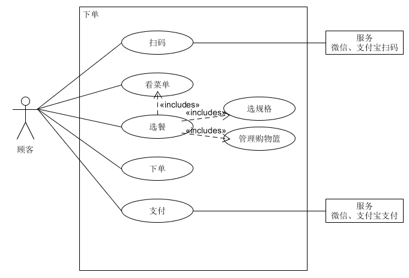
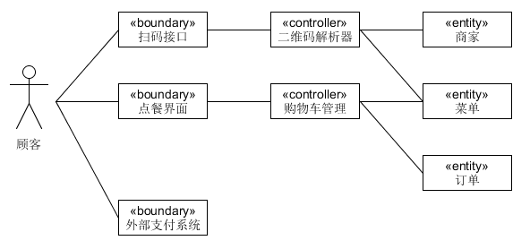
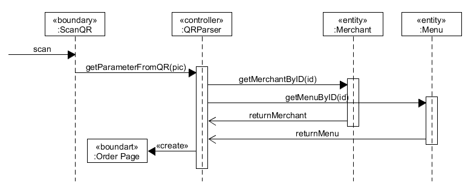
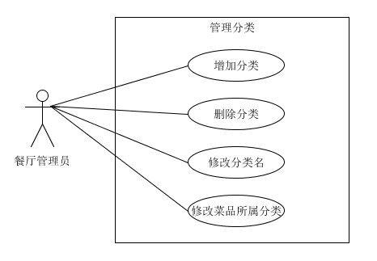

# 点餐系统 Design
{:.no_toc}

* 目录
{:toc}

## 7.5 Usecase design

### 用例1：点餐下单

| 版本 | 日期 | 描述 | 作者|
| -- | -- | -- | -- |
| 1.6.0 | 2018.12.29 | 详述版用例 | zq |

#### 用例描述
**用例图：**  

**范围：** 客户端

**级别：** 用户目标

**主要参与者：** 客户

**涉众及其关注点：**

-  顾客：快速便捷点餐下单，清楚知道每个菜的信息
- 餐厅：减少服务员点餐收银的人工成本，让顾客点餐信息准确地直达后厨

**前置条件：** 顾客到店在一张桌子边坐下

**后置条件：** 订单信息传到餐厅管理端

**主成功场景：**

1. 直接扫描桌面二维码，查看菜单
2. 选中某样菜品，弹出浮窗选择规格，确认后添加到购物篮，购物篮累计价格。
重复步骤2，直到顾客全部选好
3. 下单，确认订单信息和价格
4. 支付，系统处理支付，下单完成
5. 餐厅收到新的订单

**扩展：**

**a.** 任意时刻发送网络请求失败  

保存好用户操作，包括已点菜品，页面状态。
  1. 询问失败是否重试
  2. 修复网络问题，网络恢复
  3. 系统重建当时的操作场景

1a. 亦可先进入小程序  

  1. 从微信顶部点击小程序图标进入，显示历史订单界面
  2. 跳到点餐界面，无菜单信息
  3. 提示用户进行扫码

2a. 选中售罄菜品  

不能添加进购物篮

2b. 取消选中某样菜品或减少份数
  1. 点开购物篮，弹出已选菜品列表
  2. 点击按钮直接减少份数或者从购物篮中移除
  3. 订单信息变化，购物篮价格相应减少

2c. 更改某样菜品规格
  1. 点开购物篮，弹出已选菜品列表
  2. 选中某项菜品，弹出浮窗显示用户之前选择的规格
  3. 更改规格，点击修改按钮确定
  4. 订单信息变化，购物篮价格相应改变

3a. 要修改订单
  1. 直接返回点餐页面

**特殊需求：**

- 列表浏览时顺滑的用户体验

**技术与数据变元表：**

**发生频率：** 十分频繁

**未决问题：**

- 系统如何处理支付

#### BCE 

#### 顺序图

#### 类图

### 用例2：注册登录

**用例图：**

#### 基本用例：

- 餐厅注册：填写账号名（邮箱）、密码、店铺名（非空），上传企业资质；
- 餐厅验证：点击邮箱链接验证信息；
- 餐厅登录：输入账号名、密码；

#### 选做用例：

- 忘记密码：邮箱验证码或链接验证【待定】，重置密码；

#### 用例名称：

​   餐厅注册与登录

#### 用例范围：

​   web网页

#### 用例级别：

​   用户目标

#### 主要参与者：

​   餐厅管理员

#### 涉众及其关注点：

​   餐厅管理员：希望能成功注册为扫码点餐系统的用户，登录系统发布餐厅的相关信息；

#### 前置条件：

​   管理员了解系统的注册与登录流程；

#### 后置条件：

​   管理员注册、登录过程输入的信息准确无误；

#### 基本流程：

- 管理员注册餐厅，填写账号名、密码和店铺名，验重通过后注册成功；
- 管理员打开邮箱，点击邮件链接，身份验证；
- 管理员登录系统，输入账号名、密码，验证通过后登录成功；

#### 特殊需求：

​   界面友好亲和，无须指导即可操作；

#### 发生频率：

​   经常发生；

#### 未决问题：

​   安全性问题；

#### 流程图：

### 用例3：菜品管理-新建菜品

#### 菜品的管理分为以下几个需求：

1. 管理分类 

**特别说明**：

如果考虑“店长推荐”“新品”这种特殊分类（是有对应需求场景的），那一个菜品应该可以属于多个分类。但在目前的方案中我们决定先限制使用单分类而不考虑这样的需求。

管理菜品所属分类时从已有分类中选择一个即可，若还没有分类则需要新建分类。  

        
2. 管理价格  

菜品依据规格定价，每个菜品有一个基础价格，再加上规格的组合确定最终价格——每个规格选项对应一个价格的增量或者减量。卡片上会显示“最低￥ 起”（若有价格区间），菜品详情会显示一组默认规格。

3. 管理菜品的基本信息  
对图、名、描述、状态、标签的增删改。

4. 查找菜品  
- 按菜品搜索
- 按状态（售卖中/已下架）筛选

5. 排序  

菜品和分类都需要排序以调整显示上的先后。  

考虑到PC端显示菜品卡片的列数会比手机移动端多，影响对顺序的理解，因此设计快速编辑模式，以列表的形式展现菜品（而非标准的卡片）。

在快速编辑的列表中可以对菜品常用的几个信息进行编辑，以拖动的交互形式进行排序。
        
**非功能性需求：编辑提示**

增删改时的必填项，输入规范等。

#### 典型用例：

对菜品具体某个信息或属性的修改删除，以及排序查找等用例都只需要简单的一两步动作，因此不做详细的文本描述。这里仅以新建菜品作为典型用例。

**用例名称：** 新建菜品

**范围：** Web应用

**级别：** 用户目标

**主要参与者：** 餐厅管理员

**涉众及其关注点：**  

管理员希望能够编辑菜品各种必要信息，方便顾客查看。

**前置条件：** 管理员正常登陆系统

**后置条件：** 生成一个新的菜品信息，PC端和小程序端均可查看。

**主成功场景（或基本流程）：**  
1. 填写菜品名称
2. 选择菜品分类
3. 上传菜品图片
4. 填写基础价格
5. 增设规格及对应价格（可选、循环）
6. 编辑附加信息（可选）
7. 增加系统默认（辣度）或自定义标签（可选）
8. 点击确认按钮，前后端同步新增菜品信息

**扩展流程：**

*a.* 系统在任意时刻失败：  
1. 管理员重启系统，登录系统
2. 系统重建上一次的状态

*b.* 任意信息填写不符合规范：
1. 提示不合规范的原因
2. 管理员重新输入

1a. 管理员输入数据库中已存在的菜品名称：  
1. 系统提示已存在该菜品
2. 重新输入菜品的名称，或退出当前的操作

2a. 暂时没有分类：
1. 提示暂无分类
2. 管理员新建一个分类
3. 再次选择

3a. 管理员上传的菜品图片超过3M：  
1. 系统提示管理员图片不能超过3M
2. 管理员重新选择合适的图片并上传

5a. 增加规格扩展流程：
1. 填写规格名，如配菜
2. 填写规格选项A的名称，并设置该选项对应的价格增降或0
3. 填写选项B、C...
4. 设置该规格对应的默认规格

8a. 有必填信息为空：  
1. 系统提示
2. 管理员补上必填信息
3. 重新点击确认

**特殊需求：**  

- 使用分辨率较高的显示器
- 服务器的健壮性，保证菜品图片能够正常显示

**技术和数据元表：**  

- 餐厅管理员通过键盘上的数字键输入菜品的价格
- 餐厅管理员需选择jpg，png，jpeg等图片格式的文件上传菜品的图片

**发生频率：** 一般或较低

**未决问题：** 暂无

#### 总流程图：

**仅画出管理菜品基本信息的具体流程图**

