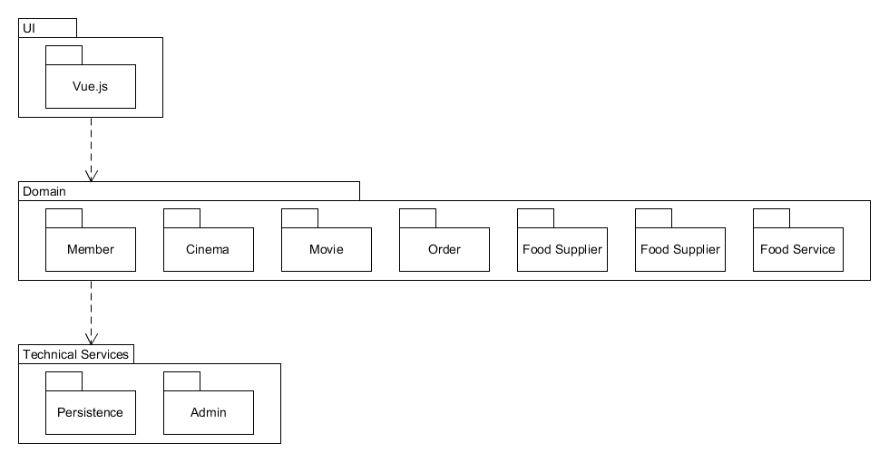

### 逻辑架构图如下：

### 目录结构如下：
TicketSelling  
|____frontend  
　　　|____dist  
　　　　　　|____index.html  
　　　　　　|____img  
　　　　　　|____static  
|____backend  
　　　|____admin.go  
　　　|____models.go  
　　　|____views.go  
|____manage.go  
|____db.sqlite3  
### ECB
详见7.5

## 映射指南：
项目框架基本上是经典的三层架构，前端UI和业务逻辑是Vue.js，后端接受请求并返回数据是Django，数据库是SQLite3。逻辑图对应目录结构是UI层（Vue.js）对应目录frontend（前端），中间Domain层主要对应目录backend，其中大部分Domain的模型存在models.go中，处理请求并返回数据的逻辑是在views.go中，admin.go主要是对数据库的管理。最后，数据库存在于db.sqlite3中，非常典型的三层架构。ECB的对应则是Boundary对应UI层（前端），Controller对应Domain（后端），Entity对应Technical Services（数据库）。