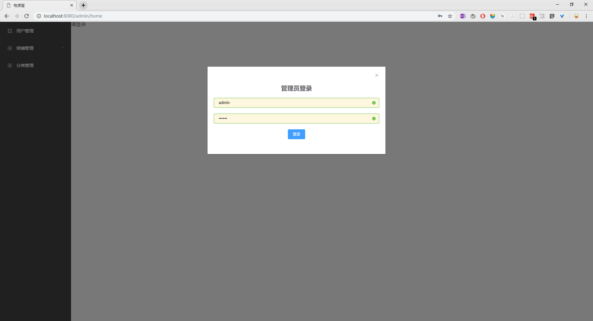
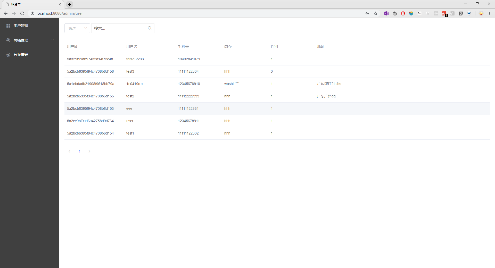
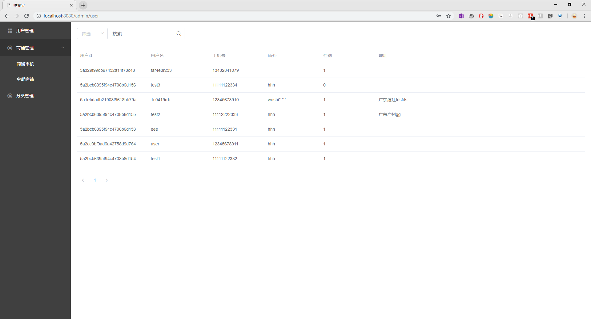
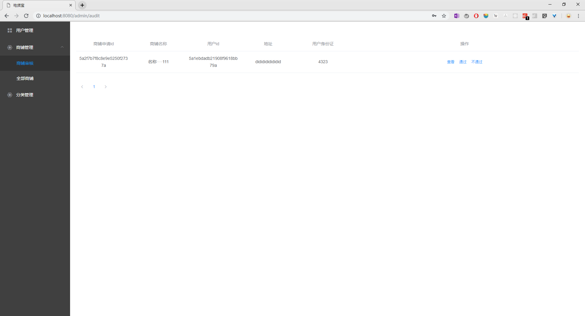
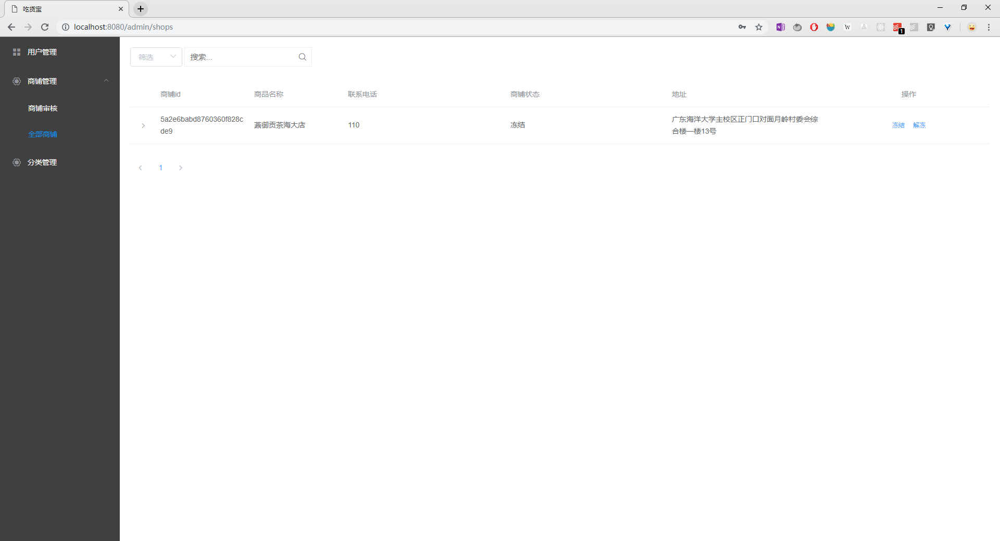
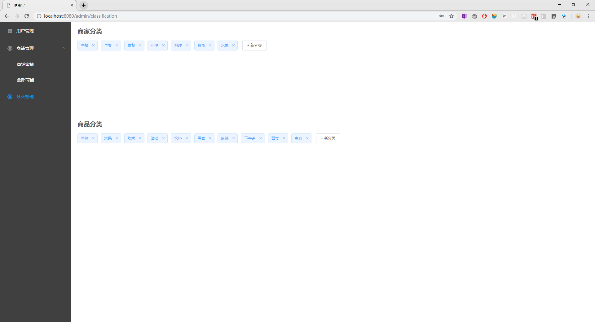
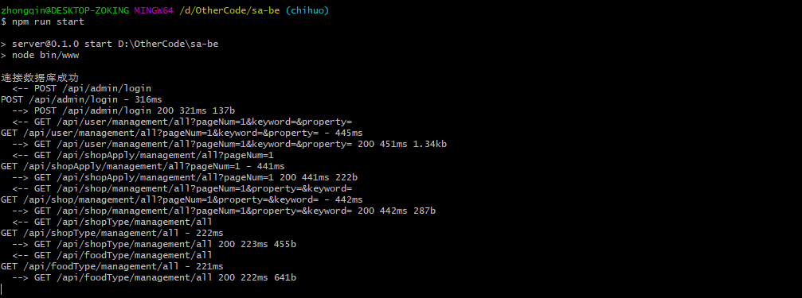

# 点餐系统成品展示-管理员
{:.no_toc}

* 目录
{:toc}

# 说明
由于内容部署在[heroku.com](https://sa-2018-fall.herokuapp.com/admin)，受平台资源限制，在访问管理员页面时，发现云端无法访问。而在本地时正常的。因此，这部分，截图展示。

# 管理员登录

# 管理用户

# 管理商铺

# 管理分类

# 程序运行截图

