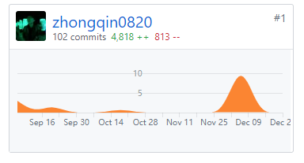
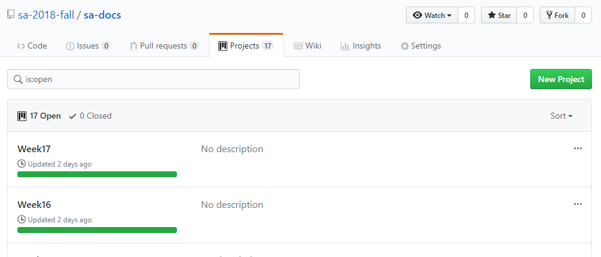

# 最终报告
{:.no_toc}

* 目录
{:toc}

## 自我总结
本次的课程学习，让我了解了整个软件开发生命周期，特别是了解了“分析”和“设计”过去的学习更侧重于学习“开发”和计算机的一些基础的理论的知识，而系分课程让我了解了开发一个软件绝不仅仅是打代码。

前期的分析设计，各种文档的编写、画各种UML图，让我知道一个软件的每一个细节的设计都是需要考虑很多东西的，学会了如何站在用户的角度，来决定一个需求是要保留还是删除，以及要以提升用户体验为目标来决定需求。

因为本次的课程学习，特地选择自己独立进行开发，因此特别是课程项目这一块，我的收货还是很大的。例如：如何利用Travis进行持续集成和部署以及利用Git对项目进行版本控制，并且最终将项目部署在了云上：https://sa-2018-fall.herokuapp.com/。

然而，由于精力和能力有限，不可避免的，一开始遇到了很多的困难。通过老师以及搜索资料最终完成了项目。在这里，非常感谢两位老师的耐心教导。不仅教给我们理论和实践的基本知识，还教导我们要将做项目的理论方法推广到做研究中。使自己的研究工作更具工程意识。

总而言之，系统分析与设计这门课程让我收获了很多。除了在老师们的帮助下，夯实了关于软件工程和系统分析与设计方面的基础知识，还了解了许多最新的前沿技术。开阔了我的视野，提高了我的知识水平。另外还需要感谢助教们的辛勤付出，制作了精良的课程文档提供我们参考。

## PSP2.1统计表

| PSP阶段                    | 耗时(h) |
| -------------------------- | ------- |
| **计划**                       | **50**      |
| 估计任务时间            | 50       |
| **开发**                       | **114**     |
| 分析需求                | 10      |
| 生成设计文档            | 22      |
| 设计复审                | 10       |
| 代码规范                | 7       |
| 具体设计                | 10       |
| 具体编码                | 50      |
| 代码复审                | 5       |
| 事后总结，提出过程改进计划 | 1       |
| **部署/维护** | **45** |
| 部署云端：数据库mlab.com、程序heroku.com | 25 |
| 维护 | 20 |
| **合计**                   | **200**  |

## Git报告：截图时间为16周
**由于在后期为了代码更方便管理，将前端部分的内容迁移到了一个新的仓库，这里展示的后端仓库的提交记录**

（由于研究生时间有限，而本次项目只有一人，所以出现间歇性提交的情况，希望谅解。）

## 看板管理：截图时间为17周

**[Github看板内容](https://github.com/sa-2018-fall/sa-docs/projects)**

